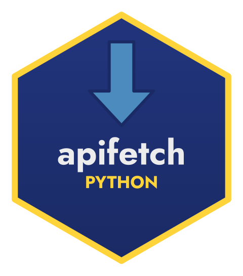

<p align="center">
  
</p>

# apifetch (Python)

[](https://pypi.org/project/apifetch/)
[](https://pypi.org/project/apifetch/)
[](https://github.com/StrategicProjects/apifetch-py/actions/workflows/ci.yml)
[](https://pepy.tech/project/apifetch)
[](LICENSE)
[](https://doi.org/10.5281/zenodo.21364969)
[](https://CRAN.R-project.org/package=apifetch)

`apifetch` is a small, dependency-light toolkit for talking to
token-authenticated REST APIs. It handles three recurring chores:

1. **Token management** — store/get/remove/list tokens in process environment
   variables (never written to disk), namespaced per service.
2. **Request building** — pluggable **authentication** and **pagination**
   strategies, bundled into a reusable `Api` profile.
3. **Data retrieval** — fetch one page, or fetch everything in chunks.

This is the Python sibling of the R package
[apifetch](https://github.com/StrategicProjects/apifetch). Both were extracted
from the [BigDataPE](https://github.com/StrategicProjects/BigDataPE) package,
which is now one *use case* (see `examples/bigdatape.py`).

## Installation

```bash
pip install apifetch
```

## Usage

```python
import apifetch as af

# 1. Describe the API once: where, how to authenticate, how to paginate.
api = af.Api(
    endpoint="https://api.example.com/v1/search",
    service="Example",
    auth=af.AuthBearer(),                 # "Authorization: Bearer <token>"
    pagination=af.PaginateOffset(where="query"),
)

# 2. Store a token (kept only in this process's environment).
af.store_token("reports", "my-secret-token", service="Example")

# 3. Fetch.
one_page = af.fetch(api, "reports", limit=50)
everything = af.fetch_all(api, "reports", chunk_size=1000)

# Optional: turn it into a DataFrame.
# import pandas as pd; df = pd.DataFrame(everything)
```

### Strategies

**Authentication:** `AuthBearer`, `AuthRaw`, `AuthHeader`, `AuthQuery`.

**Pagination:** `PaginateOffset(where="header" | "query")`, `PaginateNone`.

## License

MIT © André Leite
